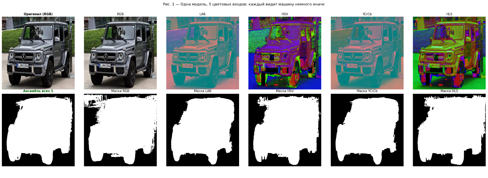
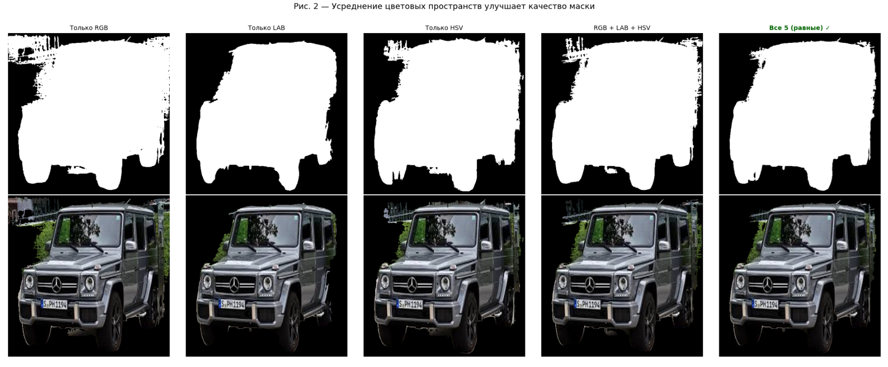
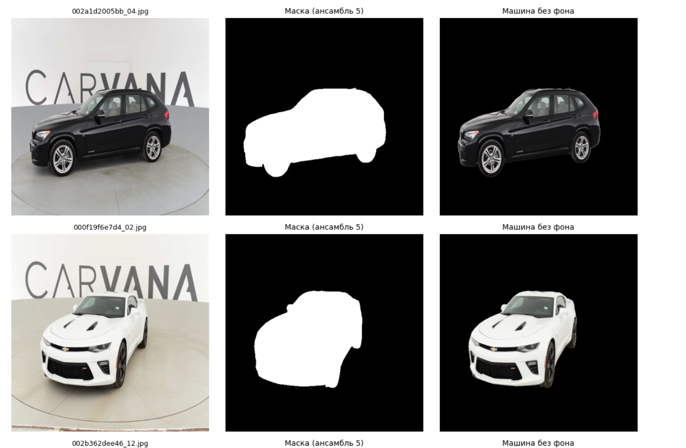
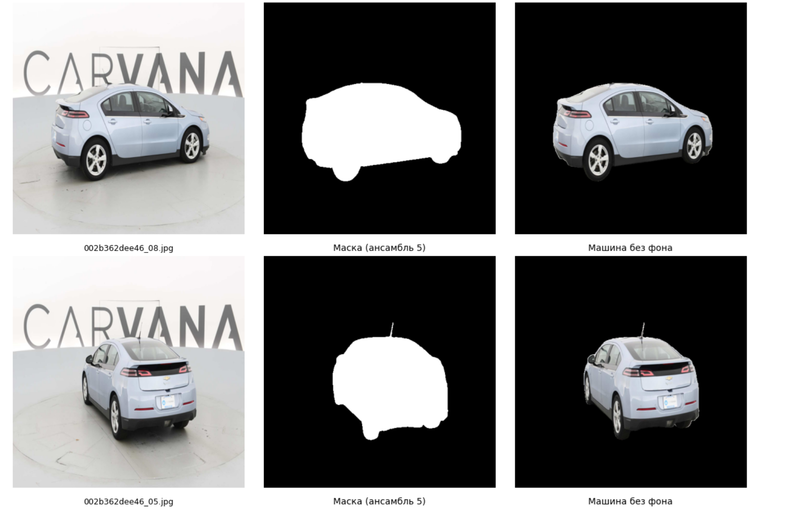
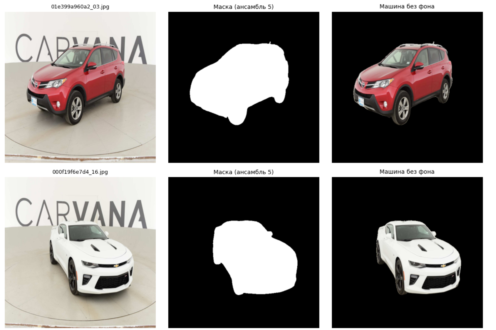
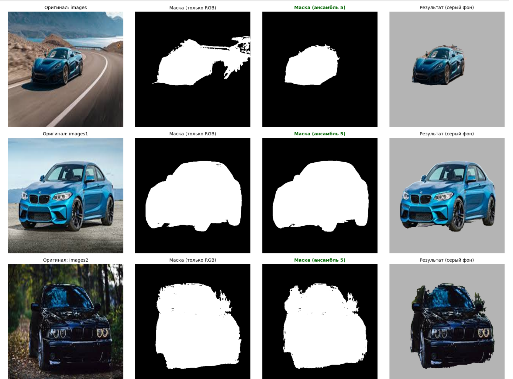
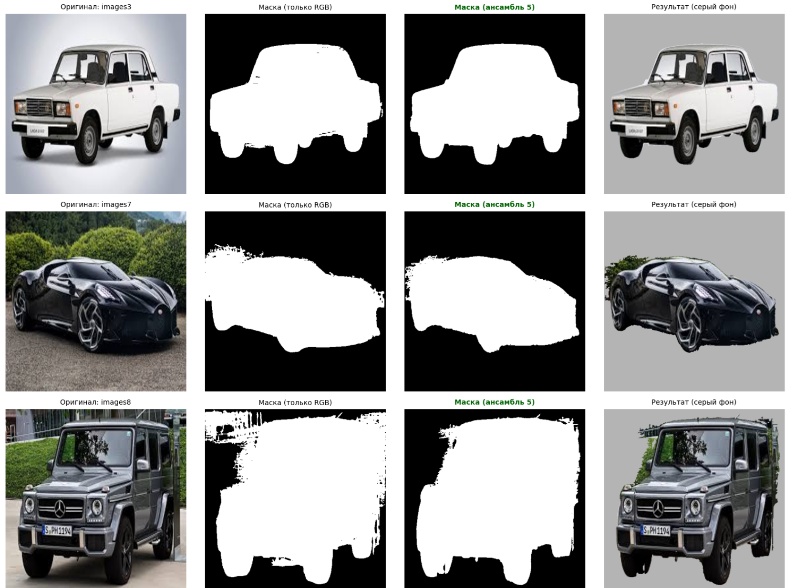
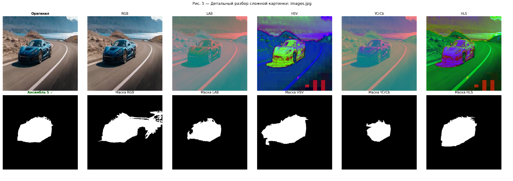
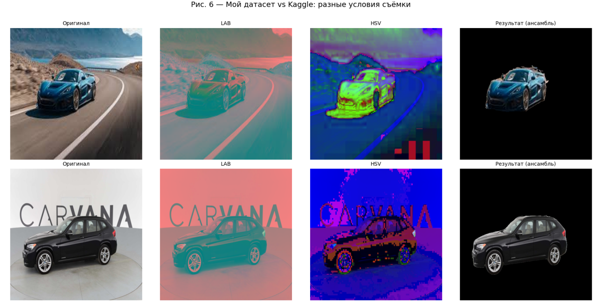
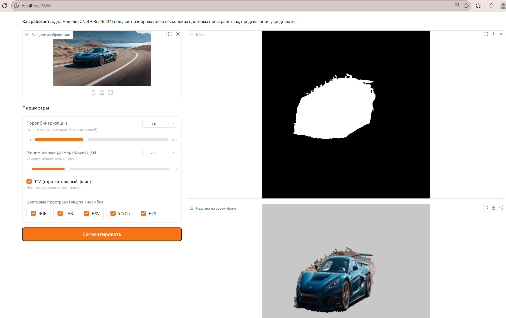

# Сегментация автомобилей

Бинарная сегментация автомобилей на фотографиях с помощью глубокого обучения.  
Датасет — [Carvana Image Masking Challenge](https://www.kaggle.com/c/carvana-image-masking-challenge) · **Val IoU: 0.89**

---

## 1) С чего всё начиналось

Отправной точкой стал классический UNet, обученный с нуля на датасете Carvana. Модель работала, но сходилась медленно и упиралась в потолок качества — энкодер заново учил базовые визуальные признаки вместо того, чтобы опираться на уже накопленные знания.

Следующим шагом стала замена энкодера на предобученный ResNet34. Эффект был заметен сразу: меньше эпох, лучше обобщение, чище границы маски. После этого фокус сместился с архитектуры на стратегию обучения.

Несколько важных улучшений пришли последовательно: взвешенный BCE-лосс, который штрафует ошибки на границах машины втрое сильнее чем внутри силуэта, SoftDice-лосс для балансировки классов, и TTA (горизонтальный флип) при инференсе.

Из них мне особенно хочется выделить TTA (горизонтальный флип) при инференсе - по сути мы подаем изображение + это же перевернутое изображение,
но подаём мы его не на обучающей выборке(когда аугментации делаем) а именно во время обученив  - в момент валидации 
Модель не абсолютно симметрична. Она обучалась на случайных батчах, видела больше машин с одной стороны чем с другой, её веса имеют лёгкую асимметрию. Это значит что предсказание на оригинале и предсказание на перевёрнутой картинке будут немного отличаться — и именно в разных местах
Там где оригинал неуверен — флип часто уверен, и наоборот. Среднее сглаживает эту неуверенность и даёт более стабильный результат.

---

## 2) Неожиданное наблюдение

В процессе экспериментов с инференсом обнаружилась интересная особенность. Если подавать одно и то же изображение в разных цветовых пространствах — LAB, HSV, YCrCb, HLS — модель возвращает заметно разные маски. Не кардинально разные, а именно дополняющие друг друга: там где RGB неуверен в тени, LAB уверен; где HSV путается на блике, YCrCb справляется чисто.

Причина понятна: каждое цветовое пространство по-своему разделяет яркость и цвет, что делает одни границы более видимыми, а другие — менее. Одна модель, получающая пять разных «взглядов» на одну сцену, производит пять масок, которые расходятся именно там где нужно.

Усреднение этих пяти масок оказалось одним из самых эффективных улучшений во всём проекте.




---

## 3) Развитие идеи: Consistency Loss

Наблюдение было перенесено в обучение. Вместо того чтобы показывать модели только RGB-изображения, каждый батч стал прогоняться через модель в трёх цветовых пространствах одновременно (RGB, LAB, HSV). К основному лоссу добавился consistency loss — штраф за расхождение между тремя предсказаниями. Модель училась сегментировать согласованно вне зависимости от представления входа.

Этот подход близок к multi-view consistency regularization — технике из медицинской сегментации, где важна устойчивость модели к вариациям входных данных.



Как видим, получился достаточно неплохой результат - но стоит заметить картинка была взята не с тестового датасета, предложенного каглом, а просто из интернета, поэтому конечно есть неточности(стоит учитывать что банально может быть низкое качество изображения, сливающийся с машиной фон,отражение в стекле машины)
---

## **4)Результаты**

| Метрика | Значение |
|---|---|
| Val IoU | **0.89** |
| Стратегия инференса | ансамбль 5 цветовых пространств + TTA |
| Тест | чистые маски на студийных и реальных фото |

Модель уверенно работает как на контролируемых студийных условиях датасета Carvana, так и на реальных фотографиях с тенями, бликами и разным фоном.

### 4.1) Результаты на тестовом датасете

Давайте посмотрим на результаты, которые можель выдает на тестовом датасете Carvana:







### 4.2) Результаты с моего датасета

**1) Давайте теперь посмотрим на небольшой собранный мной датасет из интернета.**

Картинки из интернета — разное качество, сложные условия съёмки, тени, нестандартные ракурсы, поэтому результаты здесь хуже.






**2) Давайте также рассмотрим более подробно одну конкретную картинку из моего датасета**



В чем сложность этой картинки?

  -низкое качество
  
  -машина располагается далеко на снимке
  
  -тень сливается с машиной

**3) ТАкже давайте сравним визуально как выглядят результаты с разных датасетов:**



---

## 5) Пайплайн инференса

```
Входное изображение
        ↓
Конвертация в 5 цветовых пространств: RGB · LAB · HSV · YCrCb · HLS
        ↓
UNet + ResNet34 энкодер (предобучен на ImageNet)
        ↓  (× 5, с TTA для каждого)
5 карт вероятностей
        ↓
Взвешенное усреднение
        ↓
Итоговая бинарная маска
```

---

## 6) Архитектура и обучение

**Модель:** UNet с энкодером ResNet34, предобученным на ImageNet  
**Лосс:** `WeightedBCE (граница ×3) + SoftDice + Consistency Loss`  
**Оптимизатор:** AdamW с раздельными lr для энкодера (1e-4) и декодера (1e-3)  
**Планировщик:** ReduceLROnPlateau  
**Аугментации:** горизонтальный флип, поворот ±10°, случайный кроп, ColorJitter  

---

## 7) Структура проекта

```
car-segmentation/
  src/
    dataset.py    ← CarvanaDataset + конвертация цветовых пространств
    model.py      ← UNet + ResNet34
    loss.py       ← WeightedBCELoss + SoftDiceLoss + CombinedLoss
    trainer.py    ← цикл обучения + consistency loss + TTA + IoU
  train.py        ← запуск обучения
  predict.py      ← инференс с ансамблем
  inference.ipynb ← эксперименты с цветовыми пространствами
  report.ipynb    ← разбор результатов с визуализациями
  config.yaml     ← все гиперпараметры
```

---

## Установка

```bash
pip install -r requirements.txt
```

Зависимости: PyTorch ≥ 2.0, torchvision ≥ 0.15, OpenCV, Pillow, tqdm, pyyaml

---

## Датасет

Скачать с Kaggle и распаковать:

```
data/
  train/          ← .jpg изображения
  train_masks/    ← .gif маски
```

Указать путь в `config.yaml`:

```yaml
data:
  root: "путь/до/carvana"
```

---

## Обучение

```bash
# Обучение RGB модели с consistency loss (рекомендуется)
python train.py --colorspace rgb

# Обучение на конкретном цветовом пространстве
python train.py --colorspace lab
python train.py --colorspace hsv
```

Ключевые параметры в `config.yaml`:

```yaml
train:
  epochs: 20
  batch_size: 8
  lr_encoder: 0.0001
  lr_decoder: 0.001

consistency:
  weight: 0.1          # 0.0 — отключить, 0.1 — рекомендуется
  view_weights: [0.5, 0.3, 0.2]
```

---

## Инференс

```bash
python predict.py --img путь/до/машины.jpg
```

Для интерактивных экспериментов — сравнение цветовых пространств, подбор порога, визуализация всех 5 масок — открыть `inference.ipynb`.

---

## 8) Идеи для развития

- **Высокое разрешение** — датасет Carvana содержит HQ-версию изображений (1918×1280); обучение на полном разрешении улучшит точность на границах
- **Обученные веса ансамбля** — вместо фиксированных весов для каждого цветового пространства небольшая обучаемая голова могла бы взвешивать предсказания динамически в зависимости от содержимого изображения
- **Дополнительные цветовые пространства** — градиентные карты или пространство оппонентных цветов могут внести дополнительный сигнал
- **Ансамбли из нескольких моделей**

## 9) Быстрый запуск через Docker

Самый простой способ попробовать проект — Docker. Не нужно устанавливать зависимости вручную.

**Шаг 1.** Скачайте веса модели и положи в папку:
```
checkpoints/rgb/best_model.pth
```

**Шаг 2.** Запустите:
```bash
docker-compose up --build
```

**Шаг 3.** Откройте браузер: [http://localhost:7860](http://localhost:7860)

Загрузите фото автомобиля — получите маску, машину на сером фоне и PNG с прозрачным фоном.

```
┌─────────────────────────────────────────┐
│   Car Segmentation                    │
│                                         │
│  [Загрузить фото]   Порог: 0.5          │
│                     Мин. объект: 1%     │
│                     TTA: ✓              │
│                     Пространства: все 5 │
│                                         │
│  [Маска] [Серый фон] [Прозрачный фон]  │
└─────────────────────────────────────────┘
```

**Если есть GPU** — раскомментируйте секцию `deploy` в `docker-compose.yml`.

**Без Docker** — запускайте напрямую:
```bash
pip install -r requirements.txt
python app.py
```

Через Docker - удобно запускать, потому что получаем **прикольное интерактивное окошко, в котором вы можете настраивать параметры и загружать свои картинки в готовую модель:)**


